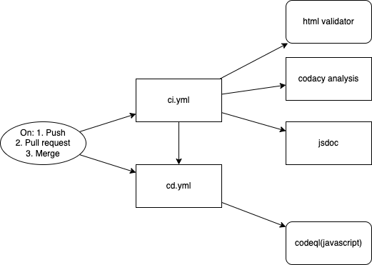

# CI/CD pipeline

**Team number:**
26

**Team name:**
Code cowboys

**What is currently working**
- Check HTML documents validity by HTML validator
- Do static code quality check and linting to CSS, js file via Codacy Analysis CLI
- Check if js file contains any errors via codeQL
- Generate documentation and deploy it as HTML web page via jsdoc 

**To-dos (In-progress)**
- Run exisiting unit test file & E2E file in pipeline 
- Let jsdoc run only when all test file also passes