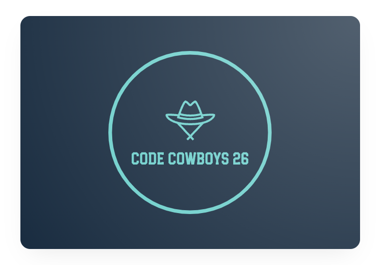
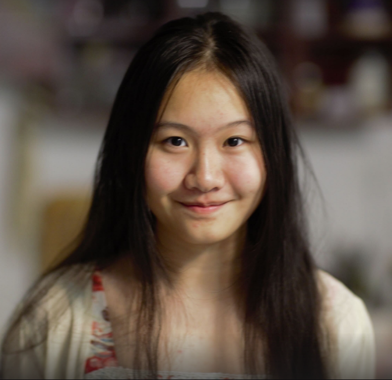
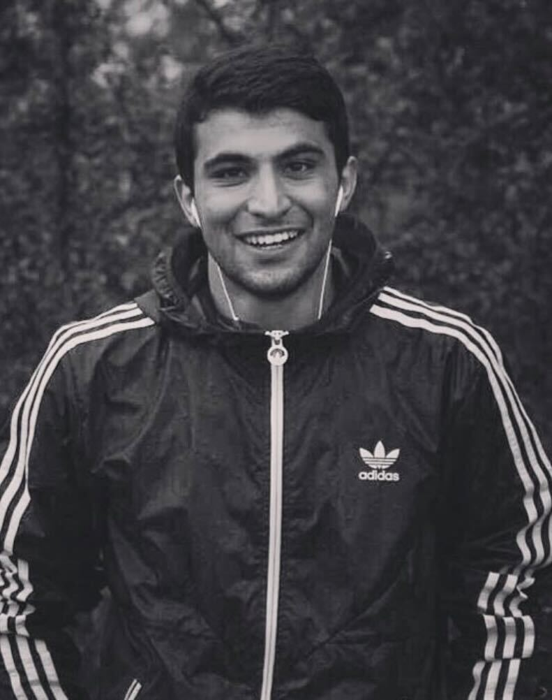
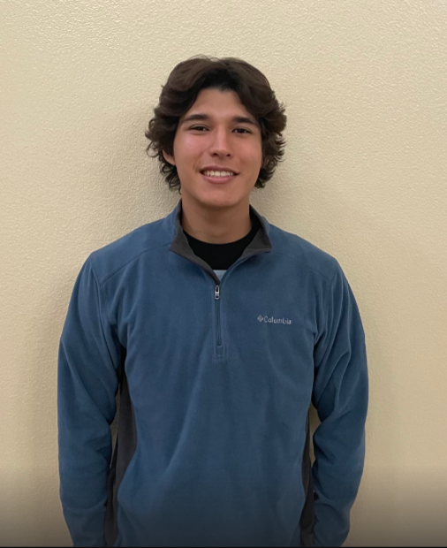
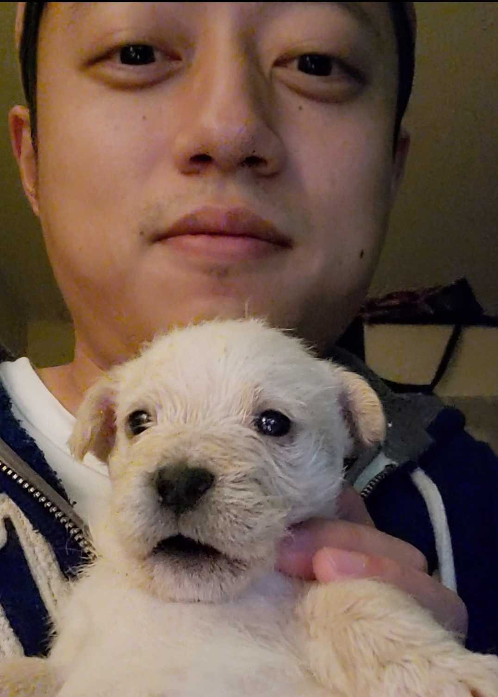
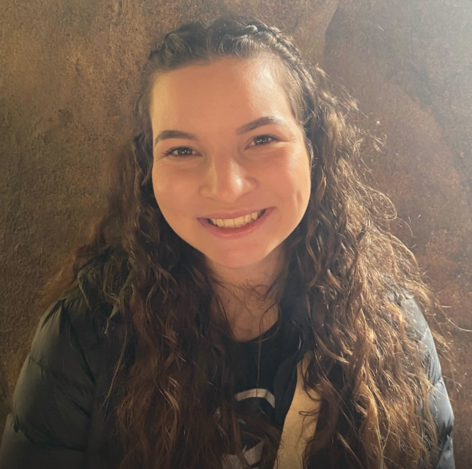
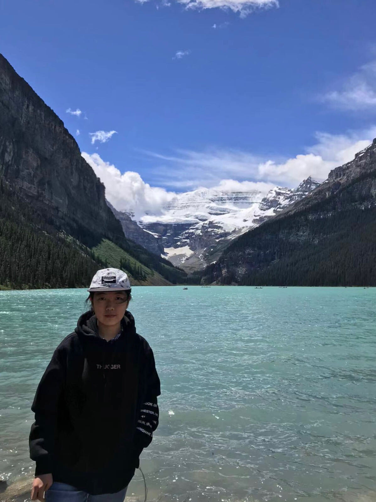
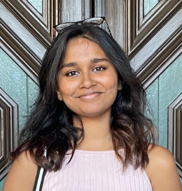

# Code Cowboys 26

# Team Brand

[What is a Cowboy Coder?](https://www.techslang.com/definition/what-is-cowboy-coding/)

**Code Cowboys** was named after the team's shared interest in creating a project through careful planning and open-ended discussion. As we develop our project, we strive to uphold a cowboy's ambitious drive to explore undiscovered heights while innovating a new pathway for others to embark on. We hope to redefine **'Cowboy Coding'** by reminding ourselves to collaborate with one another and hold ourselves to the policies and standard we agreed on at the start of the project. With such inspirations, we will use the positives of Cowboy Coding to develop a creative solution that benefits the experience and needs of users in the *real world*.

# Team Values
## Ambitious
* We are willing to take risks and face failure in our attempt to find efficient solutions across our product. 
## Adventurous
* We seek unmapped techniques to learn uncommon yet durable features and systems that can be integrated into our app. 
## Innovative 
* We aim to develop a unique product that is both valuable and informative to the public, ultimately creating a project that can be modeled after by others.

# Meet the Cowboys

&nbsp; &nbsp; **Name**: Weiwen Dong\
\
&nbsp; &nbsp; **Team Role**: Team Lead\
\
&nbsp; &nbsp; **Major:** Bioinformatics\
\
&nbsp; &nbsp; **Social(s):** [GitHub](https://github.com/w3dong) | [LinkedIn](https://www.linkedin.com/in/weiwen-dong-06b28b236/)\
\
&nbsp; &nbsp; **Bio:** Hi, I’m Weiwen, a third year Bioinformatics student who enjoys    
&nbsp; &nbsp; web development a lot :). I am also a home Barista who design my own   
&nbsp; &nbsp; recipe and makes coffee everyday!   
 
 
 

&nbsp; &nbsp; **Name**: Sepehr Heravi\
\
&nbsp; &nbsp; **Team Role**: Team Lead\
\
&nbsp; &nbsp; **Major:** Computer Science\
\
&nbsp; &nbsp; **Social(s):** [GitHub](https://github.com/sepehrheravi) | [LinkedIn](https://www.linkedin.com/in/sepehrheravi/)\
\
&nbsp; &nbsp; **Bio:** I’m a 4th year Computer Science major. When it comes to coding, my    
&nbsp; &nbsp; favorite languages are python and C++. I used to be waterpolo player but    
&nbsp; &nbsp; now I just play basketball as a hobby.    
 
 
 

&nbsp; &nbsp; **Name**: Alberto Valencia\
\
&nbsp; &nbsp; **Team Role**: \
\
&nbsp; &nbsp; **Major:** Mathematics-Computer Science\
\
&nbsp; &nbsp; **Social(s):** [GitHub](https://github.com/valenciaaalberto) | [LinkedIn](https://www.linkedin.com/in/alberto-valencia-241835200/)\
\
&nbsp; &nbsp; **Bio:** Hello, my name is Alberto Valencia. I am a third-year, majoring in    
&nbsp; &nbsp; Mathematics-Computer Science. In my free time, I enjoy being active whether    
&nbsp; &nbsp; that be a sport or hiking. I also enjoy attending church and practicing my    
&nbsp; &nbsp; &nbsp; &nbsp; &nbsp; &nbsp; &nbsp; &nbsp; &nbsp; &nbsp; &nbsp; &nbsp; &nbsp; &nbsp; &nbsp; &nbsp; &nbsp; &nbsp; &nbsp; &nbsp; &nbsp; &nbsp; &nbsp; &nbsp; &nbsp; &nbsp; &nbsp; my Christian faith. I am excited to be working with my team and learning    
&nbsp; &nbsp; &nbsp; &nbsp; &nbsp; &nbsp; &nbsp; &nbsp; &nbsp; &nbsp; &nbsp; &nbsp; &nbsp; &nbsp; &nbsp; &nbsp; &nbsp; &nbsp; &nbsp; &nbsp; &nbsp; &nbsp; &nbsp; &nbsp; &nbsp; &nbsp; &nbsp; more about web development.    
 

&nbsp; &nbsp; **Name**: Chengcheng Zhang\
\
&nbsp; &nbsp; **Team Role**: \
\
&nbsp; &nbsp; **Major:** Computer Engineering\
\
&nbsp; &nbsp; **Social(s):** [GitHub](https://github.com/MerlinZCC) | [LinkedIn](https://www.linkedin.com/in/cheng-cheng-zhang/)\
\
&nbsp; &nbsp; **Bio:** I am a third-year computer engineering student. In my free time,    
&nbsp; &nbsp; I enjoy watching soccer and listening to music, especially John Mayer’s.    
 
 
 
 

&nbsp; &nbsp; **Name**: Fucheng Shang\
\
&nbsp; &nbsp; **Team Role**: \
\
&nbsp; &nbsp; **Major:** Computer Science\
\
&nbsp; &nbsp; **Social(s):** [GitHub](https://github.com/shangfucheng)\
\
&nbsp; &nbsp; **Bio:** I'm 4th year, CS major, like sailing, soccer dogs, and old bimmers.   
 
 
 
 
 

&nbsp; &nbsp; **Name**: Genevieve Dietz\
\
&nbsp; &nbsp; **Team Role**: \
\
&nbsp; &nbsp; **Major:** Computer Engineering\
\
&nbsp; &nbsp; **Social(s):** [GitHub](https://github.com/gdietz8)\
\
&nbsp; &nbsp; **Bio:** I’m looking forward to seeing what our group is able to accomplish   
&nbsp; &nbsp; this quarter! In my free time I like to crochet, do yoga, and fly kites! :)    
 
 
 
 

&nbsp; &nbsp; **Name**: Jack Multani\
\
&nbsp; &nbsp; **Team Role**: \
\
&nbsp; &nbsp; **Major:** Computer Engineering\
\
&nbsp; &nbsp; **Social(s):** [GitHub](https://github.com/JackMultani) | [LinkedIn](https://www.linkedin.com/in/jackmultani/)\
\
&nbsp; &nbsp; **Bio:** Hey everyone! I'm Jack and I'm a 3rd year Computer Engineer major.    
&nbsp; &nbsp; In my free time, I like to play basketball and workout. I look forward to    
&nbsp; &nbsp; further exploring restaurants and activities in San Diego with my friends!    
 
 
 

&nbsp; &nbsp; **Name**: Ruoqian Huang\
\
&nbsp; &nbsp; **Team Role**: \
\
&nbsp; &nbsp; **Major:** \
\
&nbsp; &nbsp; **Social(s):** [GitHub](https://github.com/RuoqianHuang) \
\
&nbsp; &nbsp; **Bio:** I am 3rd year Math-Computer Science major student. I like travelling,    
&nbsp; &nbsp; listening to music, and watching anime in my free time. I hope I can gain more    
&nbsp; &nbsp; experience of working on a software engineering team project in this class.  
 
 
 

&nbsp; &nbsp; **Name**: Samhita Kadali\
\
&nbsp; &nbsp; **Team Role**: \
\
&nbsp; &nbsp; **Major:** Bioengineering:Bioinformatics\
\
&nbsp; &nbsp; **Social(s):** [GitHub](https://github.com/oksami/) | [LinkedIn](https://www.linkedin.com/in/samhitakadali/)\
\
&nbsp; &nbsp; **Bio:** Hello, I’m Samhita Kadali! I’m from Texas and I’m 4th year   
&nbsp; &nbsp;  Bioengineering:Bioinformatics major.    
 
 
 
 

&nbsp; &nbsp; **Name**: Ziyan Zhu\
\
&nbsp; &nbsp; **Team Role**: \
\
&nbsp; &nbsp; **Major:** Ph.D. Candidate in Mathematics\
\
&nbsp; &nbsp; **Social(s):** [GitHub](https://github.com/ZiyanZhu1994) | [LinkedIn](https://www.linkedin.com/in/ziyan-zhu/)\
\
&nbsp; &nbsp; **Bio:** I’m Ziyan Zhu, a PhD student from Mathematics department working on    
&nbsp; &nbsp; numerical optimization and nonlinear programming. Outside of work and study,    
&nbsp; &nbsp; I like to go for a walk outside with my dog, Peach (or PP), and enjoy the   
&nbsp; &nbsp; &nbsp; &nbsp; &nbsp; &nbsp; &nbsp; &nbsp; &nbsp; &nbsp; &nbsp; &nbsp; &nbsp; &nbsp; &nbsp; &nbsp; &nbsp; &nbsp; &nbsp; &nbsp; &nbsp; &nbsp; &nbsp; &nbsp; &nbsp; &nbsp; &nbsp; sunshine. I’m excited to work with all of you!   
 
 
 
